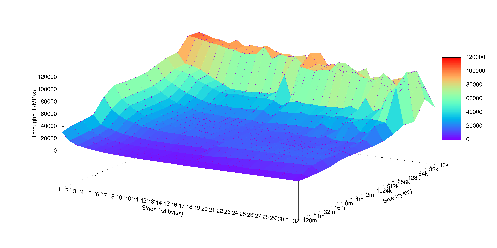

# Assignment 1

## Exercise 1: Compiling and running on Dardel. 

### Task 1.1
Describe all steps to connect to Dardel, complile the code, and execute the 
code on computing nodes with SLURM (Interactive and batch).

### Task 1.2

How many computing nodes does Dardel have? 
- 554 Nodes [488 SNIC thin, 20 SNIC large, 8 SNIC Huge, 2 SNIC Giant, 36 KTH]

How many CPUs, CPU core, and memory does each computing node have? 
- 2 CPUs, 128 Physical cores with 256 virtual cores. Memory size varies with the type of node.

What is the total number of cores and memory of the Dardel computer?
- 70912 Total cores in the CPU partition. With 156.672TB of memory.  

What is the fastest supercomputer in the world? What are the fastest European 
and Asian supercomputers? What is their power usage?
- Frontier in the world [21,1kW]. Asian - Supercomputer Fugaku [29,899kW]. European - LUMI [6,016kW].  

## Exercise 2: Sustainability and supercomputers

### Task 2.1
Using the calculator at http://calculator.green-algorithms.org/. Evaluate the 
power usage and carbon footprint of running a simulation on 10 Dardel computing 
nodes, assuming that we only use CPU, all the memory on the nodes, and we 
neglect the network costs. The simulation runs on 10 computing nodes for 
12 hours.

- 12 Hours, CPU, 128 Cores, 256gb * 10 =  20.09kg CO2, 180.71kWh

Estimate done using the EPYC 7513 processor option. 

## Exercise 3: Modeling Sparce Matrix-Vector Multiply. 

### Task 3.1
What is the performance in total execution time - do not consider data 
movement - according to your performance model on Dardel or your local 
computer for different sparse matrices = $10^2$, $10^4$, $10^6$, and 10^8?

Laptop - i7-10750H (Base 2.6Ghz - 5.0GHz)

Taking the base rate gives $1 / 2.6 \cdot 10^9$ operations/s

for each nnz:
    $$nnz = 49600 \implies 0.00001907s\\
    nnz = 4996000 \implies 0.019215s\\
    nnz = 499960000 \implies 0.192292s$$

Time for Sparse Ax, nrows=10000, nnz=49600, T = 0.000262s

Time for Sparse Ax, nrows=1000000, nnz=4996000, T = 0.028904s

Time for Sparse Ax, nrows=100000000, nnz=499960000, T = 0.598384s

What is the measured performance in total execution time and floating-point 
operations per second running spmv.c for different sizes = 102, 104, 106, 
and 108? Compare the results from the performance model and experimental 
results. Discuss the comparison in the report.

## Exercise 4: The memory mountain

### Task 4.1 
Report the name of the processor and the size of the L1, L2, and L3 of the processor you are benchmarking. You can check the specs of your processor online.

Processor: i7-10750H \
L1 = 384kB \
L2 = 1.5MB  
L3 = 12MB  

### Task 4.2

### Task 4.3
What region (array size, stride) gets the most consistently high performance (ignoring spikes in the graph that are noisy results...)? What is the read bandwidth reported?

### Task 4.4
What region (array size, stride) gets the most consistently low performance (Ignoring spikes in the graph that are noisy results...)? What is the read bandwidth reported?

### Task 4.5
When you look at the graph for stride=1, you (should) see relatively high 
performance compared to stride=32. This is true even for large array sizes 
that are much larger than the L3 cache size. How is this possible, when the 
array cannot possibly all fit into the cache? Your explanation should include 
a brief overview of hardware prefetching as it applies to caches.

## Exercise 5: Write a benchmark to measure preformance
### Task 5.1.1
[On local machine]

What is the average runtime? 
- 0.00000405s

### Task 5.1.2
Increase N and compile the code, what is the average running time now? 
- 0.00000405s

### Task 5.2.1
why is the execution time like that in the previous question when the flag -O2 
is used? Answer this question using the information you find in the assembly code.

- The compiler optimized the loop out of the code. 

### Task 5.2.2
What is the average execution time without the `-O2` flag

For N = 5000:
- 0.00004816s 

For N = 50000: 
- 0.00050402s

### Task 5.3
What is the clock granularity on Dardel or your local computer?

$$ Granularity: 9.54 \cdot 10^-7s $$

### Task 5.4.1
- Average runtime: 0.00001330s

### Task 5.4.2
- Average Exectution time: 0.000013399 s
- Min Exectution time: 0.000133991 s

