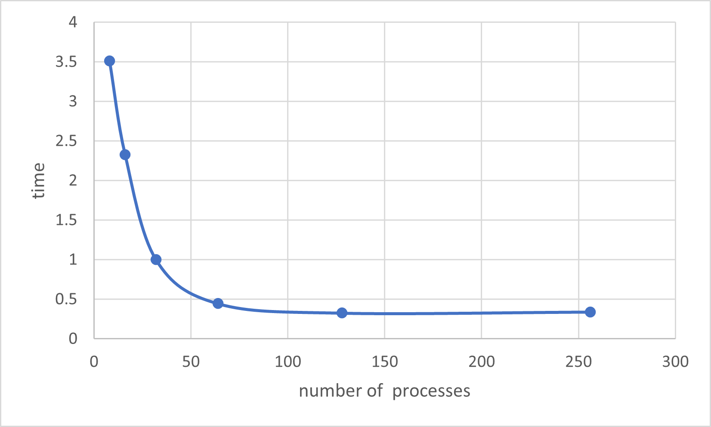

# Exercise 1 - MPI HelloWorld

**1. Write the code in C.**

```c
#include <mpi.h>
#include <stdio.h>

int main(int argc, char *argv[]) {
  int rank, size, provided;
  MPI_Init_thread(&argc, &argv, MPI_THREAD_SINGLE, &provided);

  // Get rank ID
  MPI_Comm_rank(MPI_COMM_WORLD, &rank);
  // Get number of MPI processes
  MPI_Comm_size(MPI_COMM_WORLD, &size);
  printf("Hello World from rank %d from %d processes!\n", rank, size);

  MPI_Finalize();
  return 0;
}
```

**2. How do you compile it, which compiler and flags have you used if any?** 

To compile on Dardel we use the following command: `cc HelloWorld.c -o HelloWorld`
No extra compiler flags are needed as `cray-mpich` is loaded by deafult on Dardel.

To compile on a local machine we can use 

```
mpicc HelloWorld.c -o HelloWorld
```

Here we use `mpicc` which is a compiler wrapper for MPI to make compilation easier. 
On my local machine I could equivelantly use 

```
gcc HelloWorld.c -o HelloWorld -lmpi
```

to compile.

**3. How do you run the MPI code on Dardel?**

To run MPI code on Dardel we simply use the command `srun -n 4 ./HelloWorld`, which 
will run 4 processes.

**4. How do you change the number of MPI processes?**

To change the number of processes we change the -n, which determines the number of 
processes that will be launched for the job. 

**5. Which functions do you use for retrieving the rank of an MPI process and the total number of processes?**

The rank of a process is given by the `MPI_Comm_rank(MPI_Comm comm, int* rank)` method.
Where comm is the MPI communicator, often `MPI_COMM_WORLD`, and the rank ID will be assigned 
to the given rank parameter. 

The total number of processes is obtained similarly to above. We use the 
`MPI_Comm_size(MPI_Comm comm, int* size)` command. Where the total number of processes will be returned to the 
given size parameter. 

**6. What are the names of the most used MPI implementations?**

The most commonly use implementations of MPI are:

- MPICH 
- OpenMPI

# Exercise 2 - Measure Network Bandwidth and Latency on Dardel with Ping-Pong

**2. Using best fit (using Matlab, Python, or similar), calculate the bandwidth and latency for 1) and 2).**

Below are the results averaged across 5 runs of the ping-pong benchmark.  

| Processes |Intra           |Inter |
|----------|----------------:|-----:|
|Time (us)      |  190.32859 | 3.59037 |
|Bandwidth  (GB/s) | 16.79437 | 23.94768 |

<!--Bandwidth of intra-communication:   16.7943784650487 GB/s \-->
<!--Latency of intra-communication:     190.32859586752318 us-->

<!--Bandwidth of inter-communication:   23.94768412896673 GB/s \-->
<!--Latency of inter-communication:     3.5903784765432594 us-->

Note: These results are unexpected, it would be expected that the intra-node 
communication to be faster than inter-node communication. 

**3. Why the postal model is not the best performance model for communication?**
    
<!--The postal model makes a number of simplifications which introduce inaccuracies, -->
<!--such simplifications are that it measures the communication rate for a single -->
<!--process, where in reality a network cannot sustain this rate. It ignores the interface-->
<!--between nodes, as well as some other network considerations such as contention and topology. -->
<!--Postal doesn't account for the different methods MPI implements for sending messages of -->
<!--different sizes. -->

The Postal model is not the best for modelling performance due to a number of 
simplifications the model makes about the network and node communication. One 
simplification it makes is to measure the communication rate for a single process, 
in reality, the network cannot sustain this rate of communication, giving skewed 
results. 

Another simplification is how the model ignores the bandwidth limits at the interfaces 
of the nodes. This means in applications where bandwidth is a limiting factor 
the results will be inaccurate.

It also doesn't account for the different communication methods used for 
messages of different lengths, such as eager and rendezvous. 

**4. How you would you improve the ping pong test after have read the paper?**

There are a number of ways you could improve the ping pong benchmark. 
Two which were already mentioned in the paper were to recognise the eager/rendezvous 
threshold for sending messages of different sizes, and to take the bandwidth of 
the interface between the nodes. 

The methods mentioned in the paper, being

- Accounting for the eager/rendezvous threshold, and 
- Taking the bandwidth limits of the interfaces of nodes 

are a good step to improving the accuracy of the ping pong bench mark, one could
increase the accuracy of the model by taking contention and congestion of multi-processes running on a single node 
which have shared resources and cache.

# Exercise 3 - 1D Domain Decomposition with Blocking Communication

**1. Assume periodic boundary conditions, e.g. the first and last process will communicate. Implement the communication for the 1D domain decomposition using**

* MPI blocking point-to-point communication. 
We communicate ghost cells by sending and receiving to/from the left and right domain corresponding to the rank.
```
	// communicate ghost cells
	if (rank % 2 == 0) {
		// send to right and receive from left
		MPI_Send(&f[nxn_loc - 3], 1, MPI_DOUBLE, (rank + size + 1) % size, 0, MPI_COMM_WORLD);
		MPI_Recv(&f[0], 1, MPI_DOUBLE, (rank + size - 1) % size, 0, MPI_COMM_WORLD, MPI_STATUS_IGNORE);
		// send to left and receive from right
		MPI_Send(&f[2], 1, MPI_DOUBLE, (rank + size - 1) % size, 0, MPI_COMM_WORLD);
		MPI_Recv(&f[nxn_loc - 1], 1, MPI_DOUBLE, (rank + size + 1) % size, 0, MPI_COMM_WORLD, MPI_STATUS_IGNORE);
	}
	else {
		// receive from left and send to right
		MPI_Recv(&f[0], 1, MPI_DOUBLE, (rank + size - 1) % size, 0, MPI_COMM_WORLD, MPI_STATUS_IGNORE);
		MPI_Send(&f[nxn_loc - 3], 1, MPI_DOUBLE, (rank + size + 1) % size, 0, MPI_COMM_WORLD);
		// receive from right and send to left
		MPI_Recv(&f[nxn_loc - 1], 1, MPI_DOUBLE, (rank + size + 1) % size, 0, MPI_COMM_WORLD, MPI_STATUS_IGNORE);
		MPI_Send(&f[2], 1, MPI_DOUBLE, (rank + size - 1) % size, 0, MPI_COMM_WORLD);
  }
```
The sending and receiving is split into two parts for safety. Each node only sends or receives at any time, and not both so there is no chance of deadlock. However, this is not really necessary since the buffers are very small. The code works just as well without ping-pong messaging.

* MPI non-blocking point-to-point communication.
Non-blocking communication is similar, with the difference being the use of `Isend` and `Ireceive`:
```
MPI_Request requests[4];
MPI_Isend(&f[2], 1, MPI_DOUBLE, (rank + size - 1) % size, 0, MPI_COMM_WORLD, &requests[0]);
MPI_Isend(&f[nxn_loc - 3], 1, MPI_DOUBLE, (rank + size + 1) % size, 0, MPI_COMM_WORLD, &requests[1]);
MPI_Irecv(&f[0], 1, MPI_DOUBLE, (rank + size - 1) % size, 0, MPI_COMM_WORLD, &requests[2]);
MPI_Irecv(&f[nxn_loc - 1], 1, MPI_DOUBLE, (rank + size + 1) % size, 0, MPI_COMM_WORLD, &requests[3]);
MPI_Waitall(4, requests, MPI_STATUS_IGNORE);
```

**2. Test the results by checking the correct values are on the ghost cells and the derivative of sin(x) on the edges of the domain is correct (the derivative of sin(x) is cos(x)). Show that your code produce the correct results (especially at the ghost cells).**

The correct values of f are shown at the ghost cells:
```
My rank 0 of 8
Here are my values for f including ghost cells
-0.049068
0.000000
0.049068
0.098017
...
0.634393
0.671559
0.707107
0.740951

My rank 1 of 8
Here are my values for f including ghost cells
0.671559
0.707107
0.740951
0.773010
...
0.995185
0.998795
1.000000
0.998795

...

My rank 7 of 8
Here are my values for f including ghost cells
-0.740951
-0.707107
-0.671559
-0.634393
...
-0.098017
-0.049068
0.000000
0.049068
```
Between the processors of rank 0 and 7 we also see the periodic boundary condition is fulfilled.

For the derivative we get the following values
```
My rank 0 of 8
Here are my values for dfdx
0.999598
0.998394
0.994785
...
0.772700
0.740654
0.706823

...

My rank 3 of 8
Here are my values for dfdx
...
-0.994785
-0.998394
-0.999598

My rank 4 of 8
Here are my values for dfdx
-0.999598
-0.998394
-0.994785

...

My rank 7 of 8
Here are my values for dfdx
0.706823
0.740654
0.772700
...
0.994785
0.998394
0.999598
```
At the start and end of the domain, at rank 0 ($x=0$) and rank 7 ($x=2\pi$) respectively the derivative is $~cos(0)=1$. In the middle of the domain, between the end and start nodes of rank 3 and 4 ($x=\pi$), the derivative is $~cos(\pi)=-1$.

**3. Why `MPI_Send` and `MPI_Recv` are called "blocking "communication?**

The `MPI_Send` and `MPI_Recv` functions must wait until the buffer has been emptied or filled respectively before returning (this could be done by a temporary system buffer so the send function doesn't necessarily have to wait for the corresponding receive on the other node). This means no logic can be executed while the functions wait to return, and could be problematic if the buffers are large.

# Exercise 4 - Calculate PI with MPI

## 4.1 Collective reduce 

| Processes |        8 |       16 |       32 |      64 |     128 |      256 |      384 |
|-----------|---------:|---------:|---------:|--------:|--------:|---------:|---------:|
| Seconds   | 3.510213 | 1.788219 | 0.901785 | 0.75959 | 0.42112 | 0.140007 | 0.142021 |


As can be seen in the above graph, the preformance improves with increasing the number of Processes
up to 256 where the preformance plateaus. 
## 4.2 MPI Blocking Communication & Linear Reduction Algorithm 

**2.Measure the performance of the code (execution time) for 8, 16, 32, 64, 128, (possibly 256) MPI processes and plot it. How the execution time scale with the number of processes? What is the MPI function for timing?**

| Processes |        8 |       16 |       32 |      64 |     128 |      256 |
|-----------|---------:|---------:|---------:|--------:|--------:|---------:|
| Seconds   | 3.512224 | 2.330320 | 0.999621 | 0.445600 | 0.326196 | 0.340048 |




Execution time decreases as the number of processes increases, almost inversely.
The MPI function for timing is ```MPI_Wtime()```

**3.Develop a performance model for the execution time of the application (or of the communication model only) using the postal communication model for the network performance. Use the values of bandwidth and latency you found in exercise 2. Compare the results from the measurements with the performance model results.**

The postal communication model is $T=s+r n$. s is 190.32859586752318 us and r is $1/bandwidth =0.0595 ns$
In this application, the message size is 4 Bytes. The number of receiving and sending messages is 2*(the number of processes-1).  So the execution time is nearly 
$T=2(N-1)(s+r n)+NumIter \div N\times (20+pi/2)t$, 
where $N$ is the number of processes ,and $NumIter=1000000000$ in this case and $t$ is the execution time per instrucation,assuming that every operation spends only one cycle(including load and store) and ignore some instruction not within the loop.

| Processes |        8 |       16 |       32 |      64 |     128 |      256 |
|-----------|---------:|---------:|---------:|--------:|--------:|---------:|
| Seconds(model)   | 1.20104 | 0.60489 | 0.31139 | 0.173778 | 0.123242 | 0.134517 |


From the tabel, we can see that the results is quite smaller than those from the measurements. Maybe the reason is that the execaution times of some operations are large than  1 cycle.
